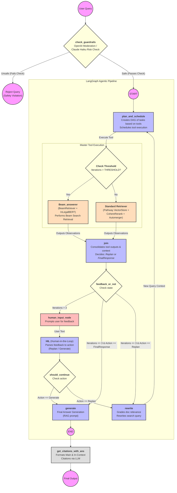

<h1 align="center">PathLex - Agentic RAG Application for Legal QA</h1>
<h3 align="center">Team 67</h3>

## Table of Contents
- [Introduction](#introduction)
- [Architecture Pipeline](#architecture-pipeline)
- [Key Features](#key-features)
  - [1. Parallel Task Execution](#1-parallel-task-execution)
  - [2. Dynamic Replanning for Retrieval](#2-dynamic-replanning-for-retrieval)
  - [3. Enhanced Retrieval Precision with Task-Specific Tools](#3-enhanced-retrieval-precision-with-task-specific-tools)
  - [4. Scalability to Complex Queries](#4-scalability-to-complex-queries)
  - [5. Plan-and-Solve Alignment](#5-plan-and-solve-alignment)
  - [6. Reduced Token Usage and Cost](#6-reduced-token-usage-and-cost)
- [Installation and Setup](#installation-and-setup)
  - [1. Setting up the Pathway VectorStore](#1-setting-up-the-pathway-vectorstore)
  - [2. Setting up the Environment Variables](#2-setting-up-the-environment-variables)
  - [3. Scripts for Quick Testing](#3-scripts-for-quick-testing)
  - [4. How to Run the Frontend](#4-how-to-run-the-frontend)
- [Solution Pipeline & Usage Guide](#solution-pipeline--usage-guide)
- [Architecture](#6-architecture)
- [Team Members](#team-members)

---

## Introduction

We introduce PathLex, an advanced agentic Retrieval-Augmented Generation (RAG) system specifically tailored for the legal domain. Built on Pathway’s real-time data processing capabilities and leveraging LLMCompiler's dynamic task planning, PathLex addresses critical limitations in existing legal RAG systems, such as hallucinations, retrieval inaccuracies, and long-context handling.

With innovations in chunking, multi-tier replanning, and robust fallback mechanisms, including a human-in-the-loop framework, PathLex ensures precise, context-aware answers with verifiable citations. This work lays the foundation for intelligent automation in high-stakes domains, demonstrating the potential for transformative improvements in legal information systems.

---

# Architecture Pipeline



---

## Key Features

### 1. Parallel Task Execution
- **Challenge:** Traditional RAG systems process retrieval queries sequentially, introducing latency when handling multiple queries.
- **Solution:** LLMCompiler employs a **planner-executor architecture** to identify independent retrieval tasks and execute them in parallel, significantly reducing latency.

### 2. Dynamic Replanning for Retrieval
- **Challenge:** In multi-hop queries, intermediate retrieval results often necessitate changes in subsequent queries or reasoning.
- **Solution:** LLMCompiler adapts dynamically through a **dynamic execution graph**, recomputing task dependencies as results come in, ensuring actions remain contextually relevant.

### 3. Enhanced Retrieval Precision with Task-Specific Tools
- **Challenge:** Generic retrieval tools often lack precision for task-specific needs.
- **Solution:** LLMCompiler integrates **specialized retrieval tools**, dynamically assigning the most relevant tool for each task to improve precision.

### 4. Scalability to Complex Queries
- **Challenge:** Traditional RAG systems struggle with multi-step queries involving intricate reasoning and dependencies.
- **Solution:** LLMCompiler creates **directed acyclic graphs (DAGs)** for task execution, efficiently managing complex reasoning and retrieval dependencies.

### 5. Plan-and-Solve Alignment
- **Challenge:** Treating retrieval and generation as a monolithic process can lead to inefficiencies.
- **Solution:** LLMCompiler breaks tasks into **manageable sub-steps** (e.g., retrieval → analysis → generation), optimizing each independently for accuracy and efficiency.

### 6. Reduced Token Usage and Cost
- **Challenge:** Excessive token consumption increases costs in traditional RAG workflows.
- **Solution:** Inspired by **ReWOO** ([Xu et al., 2023](https://arxiv.org/abs/2305.18323)), LLMCompiler **decouples reasoning from execution**, minimizing unnecessary LLM invocations and reducing token usage.

---

# Installation and Setup

## Initial Steps

> **Note:** You can only run Pathway's Server on Linux or macOS.  
> To run it on Windows, it is recommended to use WSL or Docker.

### 1. Create a Virtual Environment

```bash
python -m venv venv
source venv/bin/activate
```

### 2. Install Dependencies

```bash
pip install -r requirements.txt
```

---

## 1. Setting up the Pathway VectorStore

This is the initial step required to run Pathway's Vector Store such that it can be connected to our main pipeline for retrieval. Pathway offers real-time data processing facilities that allow documents to be added or removed from the vector store dynamically.

### Prerequisites
- OpenAI API key or [VoyageAI API key](https://www.voyageai.com/)
- `custom_parser.py` in the root directory
- Modified `server.py` in the root directory
- Stable internet connection

### Steps to Run

1. Navigate to the pathway server directory:

```bash
cd pathway-server
```

2. Create a `/data` directory and upload documents.

3. Install `tesseract-ocr` and update `TESSDATA_PREFIX` in `run-server.py`.

4. Replace API keys in `run-server.py`.

5. Start the server:

```bash
python run-server.py
```

6. The server runs at:

```txt
127.0.0.1:8745
```

7. Test the server:

```bash
python test_server.py
```

> Embedding generation may initially take time. Retrieval timeout errors may occur temporarily until indexing completes.

---

## 2. Setting up the Environment Variables

Create a `.env` file in the root directory:

```env
OPENAI_API_KEY=your_openai_api_key
ANTHROPIC_API_KEY=your_anthropic_api_key
COHERE_API_KEY=your_cohere_api_key
LANGCHAIN_HUB_API_KEY=your_langchain_hub_api_key
LANGFUSE_SECRET_KEY=your_langfuse_secret_key
LANGFUSE_PUBLIC_KEY=your_langfuse_public_key
LANGFUSE_HOST=https://cloud.langfuse.com
PATHWAY_HOST=127.0.0.1
PATHWAY_PORT=8745
```

---

## 3. Scripts for Quick Testing

You may run the backend pipeline without the UI using:

```bash
python main.py "<insert query here>"
```

Ensure:
- Pathway server is running
- `.env` is configured correctly

---

## 4. How to Run the Frontend

### Prerequisites
1. NodeJS
2. npm

### Steps

1. Install frontend dependencies:

```bash
cd legal-chatbot-frontend
npm i
```

2. Install backend dependencies:

```bash
cd legal-chatbot-backend
npm i
```

3. Start frontend:

```bash
cd legal-chatbot-frontend
npm run dev
```

4. Start backend:

```bash
cd legal-chatbot-backend
node server.js
```

---

# Solution Pipeline & Usage Guide

1. The owner logs in via the login page.
2. Users can access previous chats or create a new chat.
3. Users submit a legal query.
4. The system dynamically executes:
   - **Plan and Schedule**
   - **Joiner**
   - **Rewrite**
   - **Generate**
   - **Human-in-the-Loop (HIL)**

---

# 6. Architecture

```txt
├── Experiments and miscellaneous
│   ├── beam_retriever_train_and_exp.py
│   ├── lumber chunking.py
│   └── meta chunking.py
├── HIL.py
├── README.md
├── Reports
├── agents.py
├── anthropic_functions.py
├── beam_retriever.py
├── beam_tool.py
├── citations.py
├── globals_.py
├── imports.py
├── joiner.py
├── legal-chatbot-backend
├── legal-chatbot-frontend
├── main.py
├── output_parser.py
├── pathway_server
├── planner.py
├── prompts.py
├── requirements.txt
├── task_fetching_unit.py
├── tools.py
└── utils.py
```

---

# Team Members

- [Himanshu Singhal](https://github.com/himanshu-skid19)
- [Rishita Agarwal](https://github.com/rishita3003)
- [Ayush Kumar](https://github.com/RedLuigi1)
- [Mahua Singh]()
- [Anushka Gupta]()
- [Ashutosh Bala]()
- [Shayak Bhattacharya](https://github.com/aupc2061)
